# End to End Airbnb Data Pipeline With AWS and GCP services

This project uses AWS IAM and VPC to securely allow AWS Glue to access the Google Geocoding API and Translate API. The data is uploaded to AWS S3 from local, and processed using AWS Glue with Apache Spark. The processed data is stored in AWS S3 and can be queried using AWS Athena and visualised with AWS QuickSight.

## Setup

1. **Clone the repository**:
    
    '''git clone https://github.com/mariambadmusk/end_to_end_airbnb_data_pipeline_with_aws_and_gcp.git 
    cd scripts  XXX '''

2. **Setting Up Google Cloud APIs for Translation and Geocoding**
    1. Create a New Project
        - Visit the [Google Cloud Console Project Creation Page](https://console.cloud.google.com/projectcreate) to create a new project.

    2. Enable Cloud Translation API
        - Go to the [Cloud Translation API Marketplace](https://console.cloud.google.com/marketplace/product/google/translate.googleapis.com?hl=en&inv=1&invt=Abndqg&organizationId=0).
        - Enable the API for your project.
        - **Note**: You might need to enable billing for this. [Create a billing account](https://console.cloud.google.com/billing) to access $300 free credit.

    3. Create a Service Account for the Translation API
        - Navigate to [IAM & Admin - Service Accounts](https://console.cloud.google.com/iam-admin/serviceaccounts).

            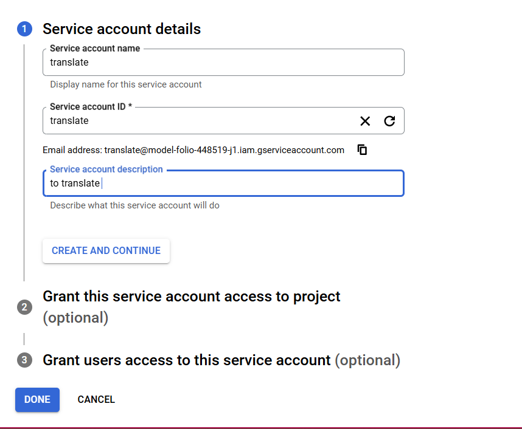

         - Create a new service account (you can use any name); **under Grant this service account access to project - choose Cloud Translation Service Agent**

                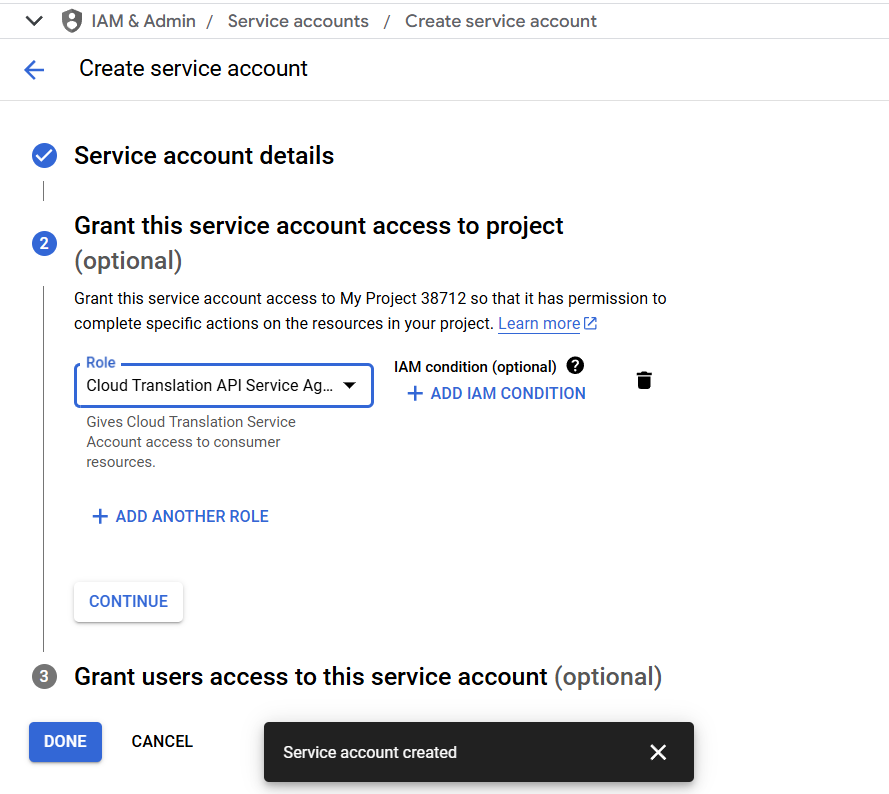 

        - After creating the service account:
        - Select the newly created service account.
        - Go to the **Keys** tab, add a new key, and download the JSON key file. **Keep this file secure**.

            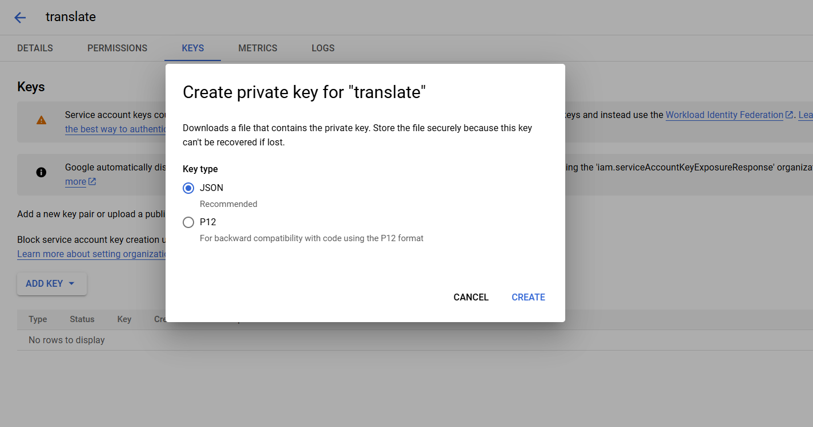
    

    4. Enable Geocoding API
        - Go to the [Google Maps APIs Console](https://console.cloud.google.com/google/maps-apis).
        - Find and enable the **Geocoding API**.

            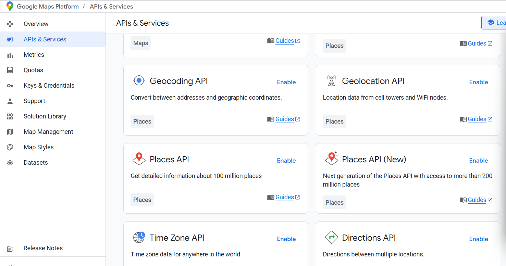

        - Copy the API key and store it securely.
        - You can choose to restrict the API key by IP address or other parameters for security purposes.

3. **Configure AWS IAM roles and policies**: Create roles and attach necessary policies for accessing AWS services.
    1. Go to IAM Management Console

    2. Create role 
        - Choose AWS service
        - Under Use case: choose Glue
        - Under permissions: AWSGLueServiceRole, (for some reason this role was not enough to to crawl S3 bucket nor create a Spark Session in Glue sucessfully so I added AdministratorAccess)
        
4. **AWS S3**: Create S3 buckets for storing raw and processed data.
    - create a raw bucket for storing raw data and *processed data and google credentials (google translate json file, google translate wheel)
    - Athena bucket for query results

5. **Run Glue Job** 

    - edit bucket paths, and google map api
    - Run scripts/translate-and-geodcoding-data-with-api.py
    - Then run scripts/airbnb_etl.py

6. **AWS Athena**: Set up Athena to query data from S3.
    - Launch Query Editor

    - Under the Editor tab, Choose AWSGLue Crawler
  
        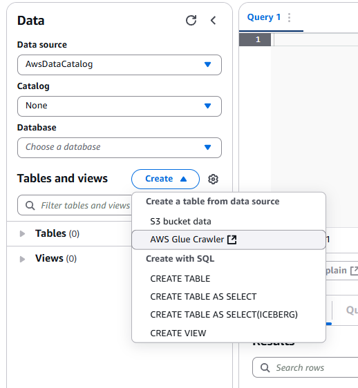

    - Under Settings tab, add S3 URI bucket already created in Step 4 under AWS S3 to store query results

         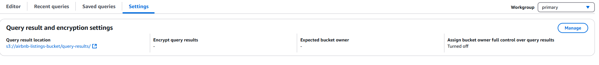

    - Configure the Crawler, add name

        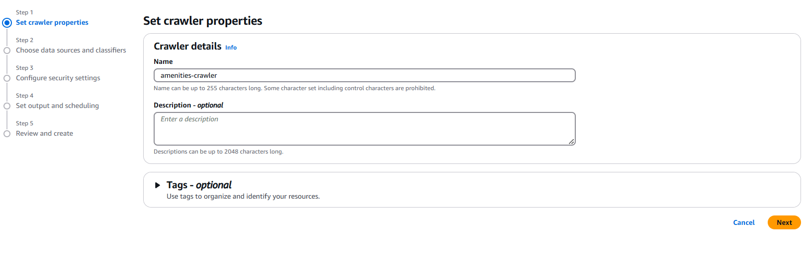

    - For the IAM role, choose the role created in Step 3 or initially ceated for AWS glue job

        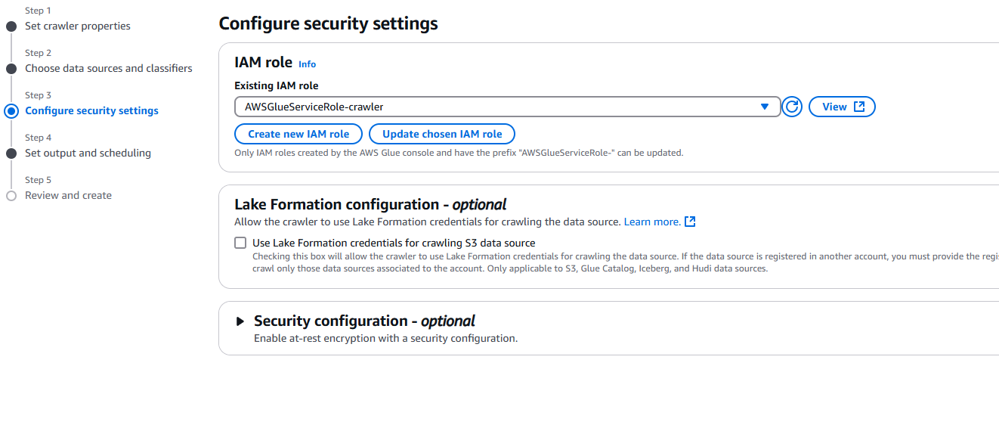
    
    - For data source
        - There was an issue with the crawler, each file was stored in its respective folder:

            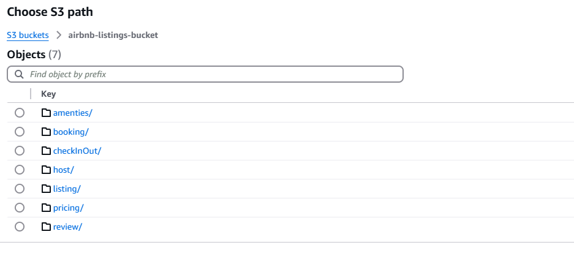

          ├── airbnb-listings-bucket               
                ├── raw-data                # a folder ; contains the csv list of the raw data
                ├── listing
                │   └──listing-dim.csv
                ├── amenities
                │   └──amenities-dim.csv
                ├── location
                │   └──location-dim.csv
                ├── host
                │   └──host-dim.csv                  
                ├── review
                │   └──review-dim.csv
                ├── booking
                │   └──pricing-dim.csv
                └──booking-fact
                    └──booking-fact.csv

    - For the database, add a name related to the project

        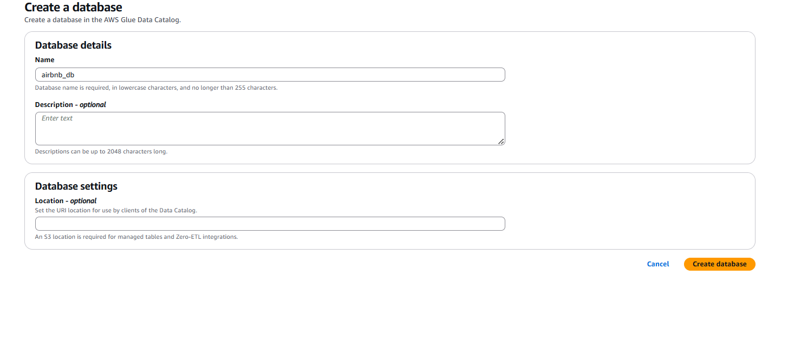
    
    - Go to Athena and refresh to see the newly added database and tables

    - Duplicate the crawler for each file edit to  choose a differnte data source in step 2; but choose the same database.
    
        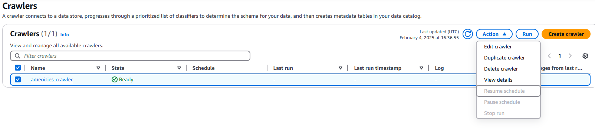

    - Run the crawlers
    - Go to Athena and refresh the database; you should see all your tables

         

7. **AWS QuickSight**: Configure QuickSight to visualise data from Athena.

8. **Clean up**

    **Disable APIs**:
    - Disable the Geocoding API in the [Google Maps APIs Console](https://console.cloud.google.com/google/maps-apis).
    - Disable the Cloud Translation API in the [Translation API Marketplace](https://console.cloud.google.com/marketplace/product/google/translate.googleapis.com?hl=en&inv=1&invt=Abndqg&organizationId=0).
    
    **Delete Service Accounts**:
    - Go to [IAM & Admin - Service Accounts](https://console.cloud.google.com/iam-admin/serviceaccounts) and delete the service accounts created for the Translation and Maps APIs.
    
    **Delete Amazon Services**
    - Delete role(s)
    - Empty then delete buckets
    - If Glue job saved, delete them too
      
    

## Contributions
Contributions are welcome! Please open an issue or submit a pull request for any improvements or bug fixes.

## License
This project is licensed under the MIT License. See the LICENSE file for details.
